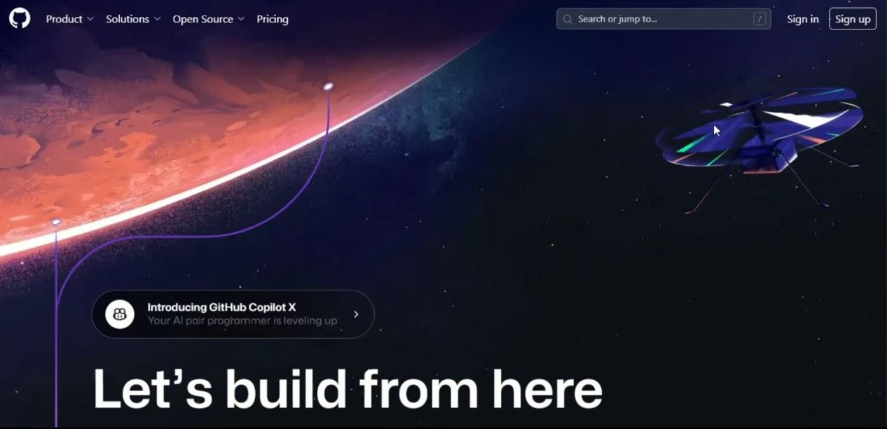
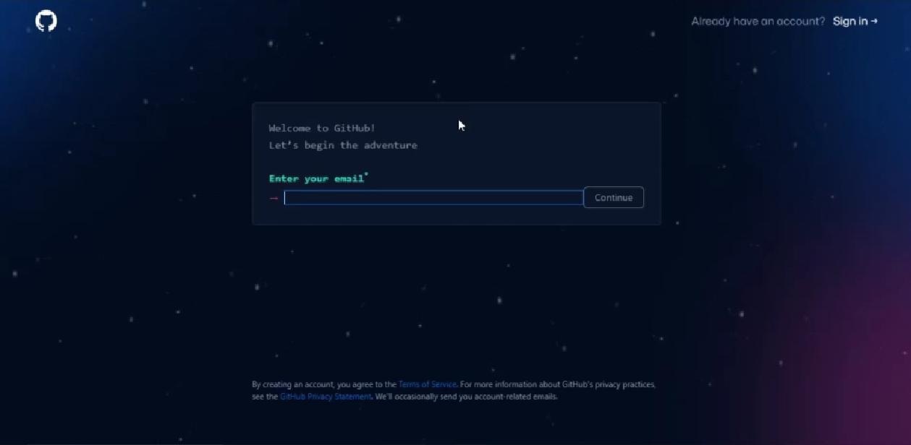
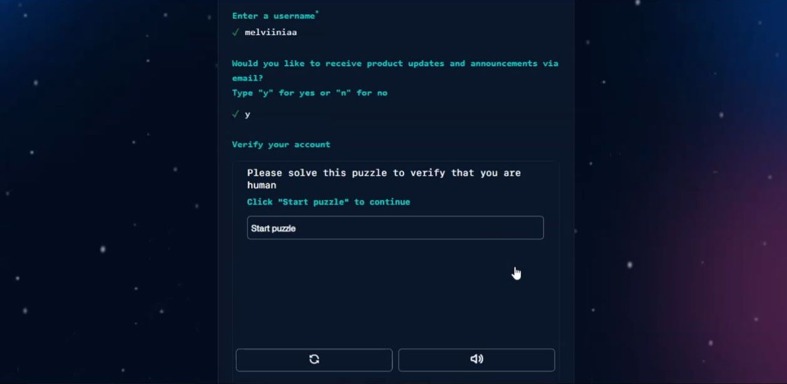
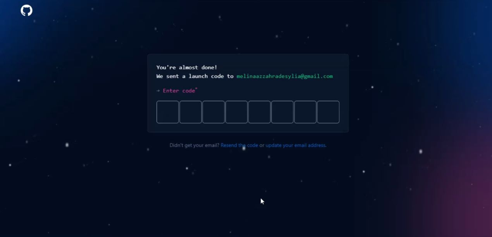
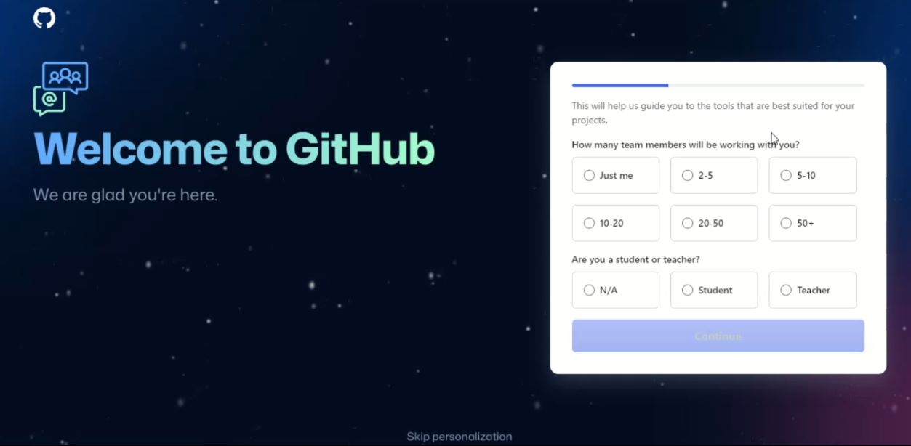
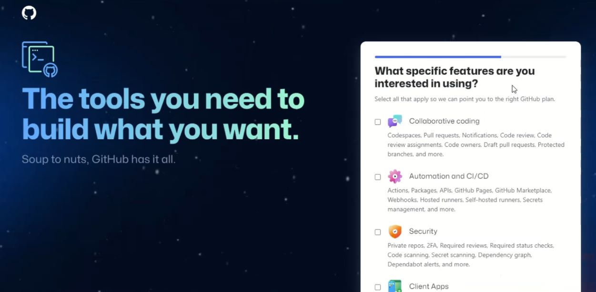
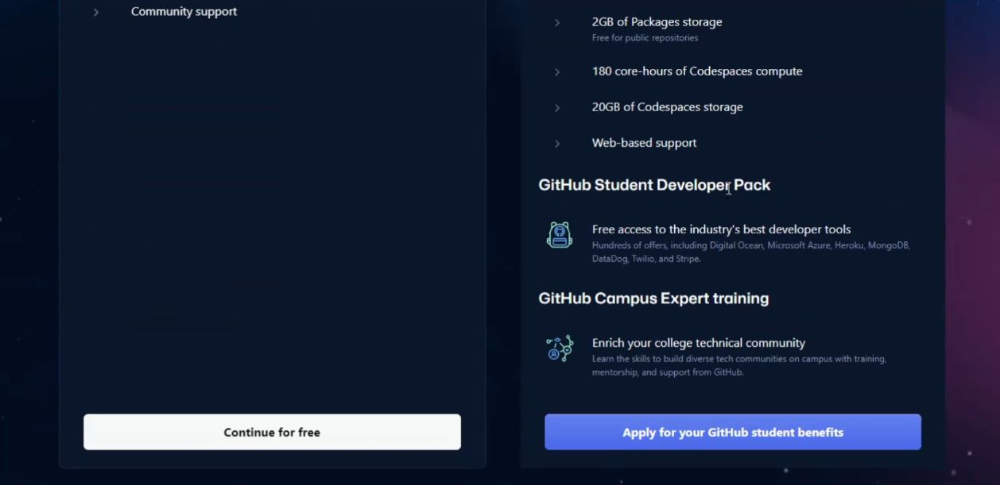
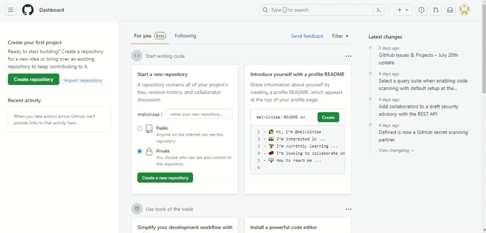

# **PASANG AKUN GITHUB**
------------------------

### Daftar Judul
1. Daftar Isi
2. Persiapan Awal
3. Apa itu GitHub?
4. Istilah dalam Github
5. Cara Membuat akun GitHub  
   - Masuk ke beranda situs github
   - Masuk ke halaman pendaftaran
   - Verifikasi dengan cek inbox email
   - Ikuti dan Lengkapi data persyaratan pendaftaran
   

### Daftar Isi
Untuk mendaftar github diperlukan beberapa tahap sebagai berikut :
1. Daftar Judul
1. Persiapan Awal
1. Masuk ke beranda situs github
1. Masuk ke halaman pendaftaran
1. Verifikasi dengan cek inbox email
1. Ikuti dan Lengkapi data persyaratan pendaftaran

### Persiapan awal
- Jaringan 
  Untuk mendaftar github diperlukan Jaringan yang stabil/lancar.
- Email aktif 
  Untuk mendaftar github diperlukan email aktif untuk aktifasi akun.
- Data Diri
- Username unik baru

#### Masuk ke beranda situs github
...
#### Masuk ke halaman pendaftaran
...
#### Verifikasi dengan cek inbox email
...
#### Ikuti dan Lengkapi data persyaratan pendaftaran

## Apa itu GitHub?

Kaliini saya akan mengajarkan kepada Anda cara membuat akun pribadi gratis pada GitHub. Tapi sebelum itu, apakah anda tau apa itu GitHub dan untuk apa Github? GitHub adalah sebuah website dan layanan berbasis cloud bagi para developer untuk menyimpan dan mengelola kode, serta mendokumentasikan dan mengontrol perubahannya.

Selain itu, GitHub juga merupakan salah satu storehouse online terbesar di dunia untuk pekerjaan kolaborasi. Sederhananya github adalah tempat simpan kode-kode dari aplikasi, tema, software, website dan sejenisnya yang mengandung source code.

Dengan akun GitHub gratis, Anda bisa mengakses repositori perangkat lunak publik dan privat secara tak terbatas, serta berkolaborasi dengan maksimal 3 pengguna. Jika menginginkan opsi yang lebih canggih, Anda bisa meningkatkan akun ke layanan GitHub Pro.

## Istilah dalam Github

* Repository

Repositori atau repo adalah direktori penyimpanan file proyek. Di sini, Anda bisa menyimpan apa pun yang berkaitan dengan proyek yang sedang dibuat, misalnya file kode, gambar, atau audio.  Bahasa lain repositori adalah suatu folder dalam Github.

* Branch

Brach merupakan salinan dari repositori milik Anda. Branch digunakan ketika Anda hendak melakukan suatu pengembangan atau development secara terpisah. Pekerjaan atau task yang dilakukan di branch tidak akan memengaruhi repositori pusat atau branch lainnya. Jika pengembangannya sudah selesai, Anda bisa menggabungkan branch saat ini ke branch lainnya dah juga repositori pusat dengan menggunakan pull request.

* Pull Request

Pull request adalah ketika Anda menginformasikan user bahwa Anda sudah push perubahan yang dilakukan di branch ke master repositori. Collaborator repositori akan menerima atau menolak pull request. Segera setelah pull request diterima, Anda bisa mendiskusikan dan mengulas proyek bersama dengan collaborator.

* Fork 

Fork artinya Anda membuat proyek baru berdasarkan repositori yang sudah ada. Dalam kalimat yang lebih sederhana, forking repo berarti Anda menyalin repositori yang sudah ada, kemudian membuat beberapa perubahan yang diperlukan, lalu menyimpan versi terbarunya sebagai repositori baru, dan menjadikannya proyek Anda sendiri.

* Commit

Commit adalah suatu rekaman / snapshot dari repository yang telah kita buat.

* Clone

Clone adalah mengambil repository dari commit

Oke, sekarang mari kita ketahui bagaimana cara untuk membuat akun di github.

## Cara Membuat akun GitHub

1. Langkah pertama click [GitHub.com](https://github.com/) agar masuk kesitus GitHub, jika sudah maka akan keluar tampilan seperti ini

2. Click sign up jika belum pernah login GitHub, maka akan keluar tampilan gambar seperti dibawah ini.

Di sini kalian bisa mengisi email, password, dan username yang akan kalian gunakan di GitHub. Juga pastikan email dan password yang kalian pakai aktif/valid, untuk username pastikan juga tidak ada orang yang mengenakan username yang sama dengan username anda.

3. Selanjutnya GitHub akan meminta persetujuan anda tentang pembaruan atau pengumuman produk/aplikasi melalui email, jika anda setuju ketik 'y' dan ketik 'n' untuk sebaliknya.

4. Tahap keempat, anda akan diminta verifikasi akun agar keamanan anda terjaga dan memastikan jika anda bukan robot, dengan cara memilih bentuk gambar yang identik/sama. Click 'Start Puzzle' untuk memulai.

5. Jika sudah, maka otomatis akan berganti ke halaman berikutnya.

Maka GitHub akan mengirim kode untuk anda verifikasi, jangan kasih tau siapa-siapa ya!

6. Jika anda sudah berhasil mendapatkan kode verifikasi nya, maka otomatis anda akan beralih kehalaman selanjutnya yang berisikan seperti gambar berikut

isi sesuai data diri dan kondisi anda! Jika sudah sesuai anda bisa langsung click 'Continue', untuk melanjutkan ke halaman berikutnya.

7. Selanjutnya pada tahap ke tujuh, anda akan disuguhkan beberapa pilihan ingin menjadi apa atau apa yang sesuai dengan bidang yang anda jalani sekarang.

Jika sudah memilih, anda bisa scroll ke bawah dan click 'Continue' untuk melanjutkan ke halaman berikutnya.

8. Pada slide ini, anda bisa memilih untuk memakai GitHub Gratis atau Pro, tampilan akan seperti ini.

Jika sudah memilih yang mana yang akan anda pakai maka scroll ke bawah dan click tombol salah satunya

9. Jika anda memilih yang gratis maka tunggu beberapa saat sampai tampilan halaman utama GitHub terbuka seperti pada gambar di bawah ini, dan GitHub siap digunakan.

