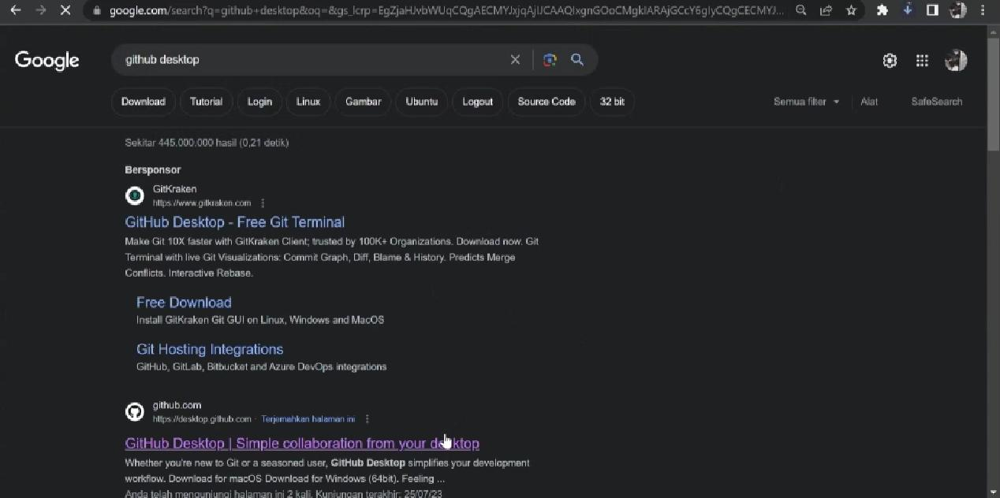
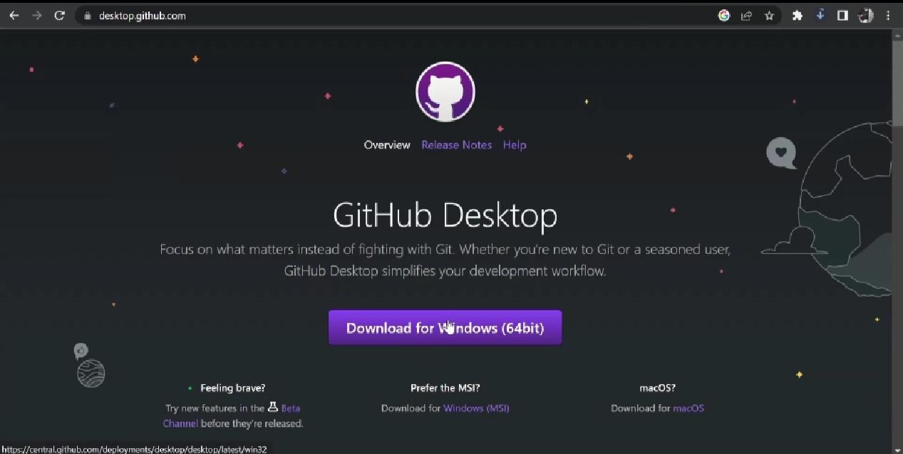
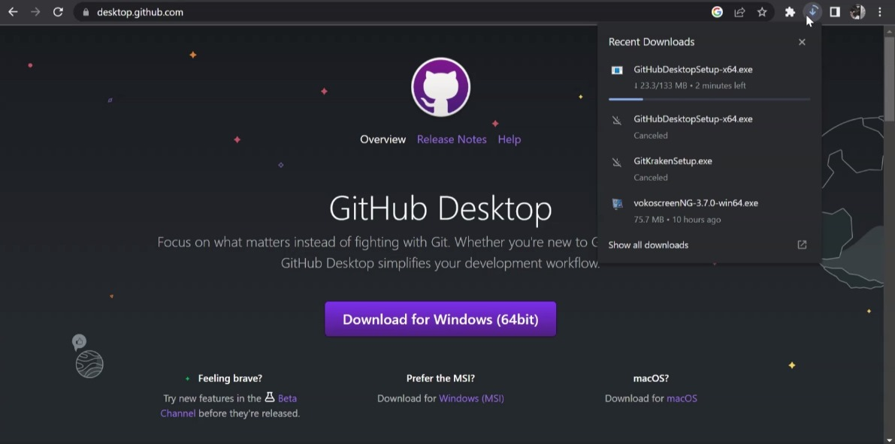
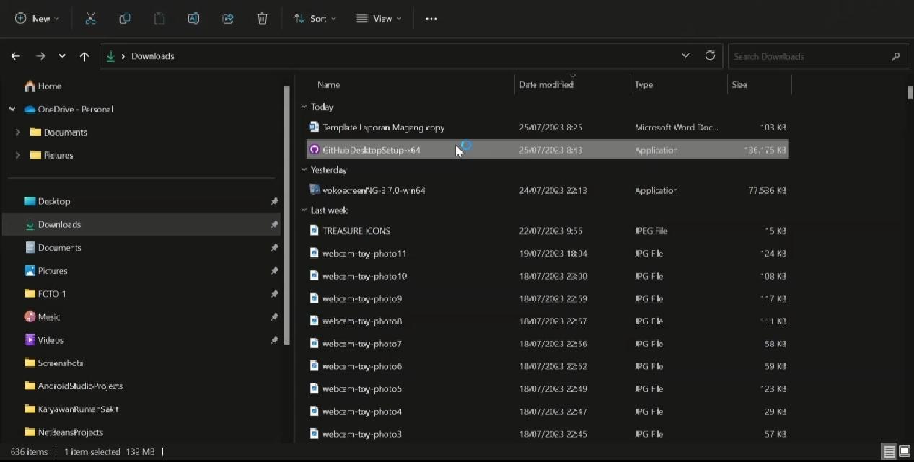
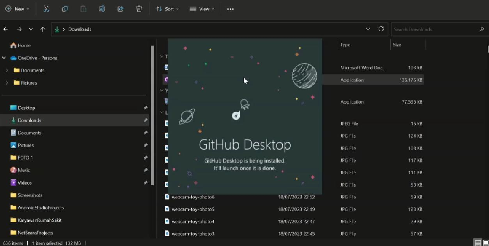
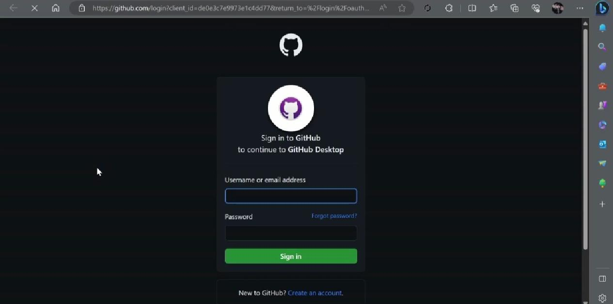
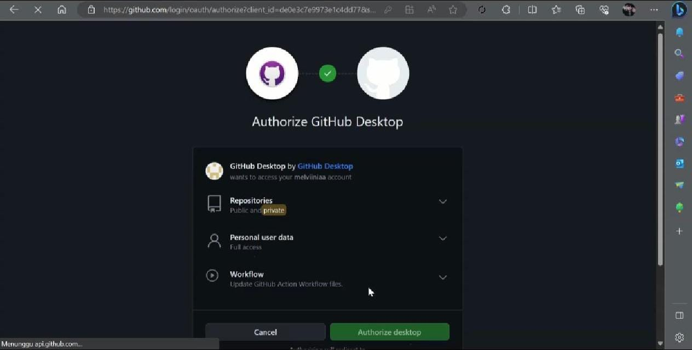
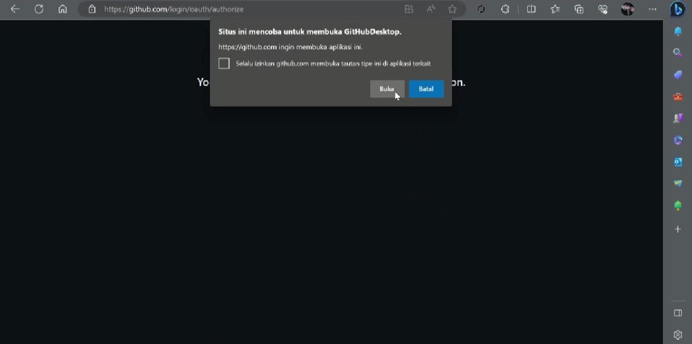
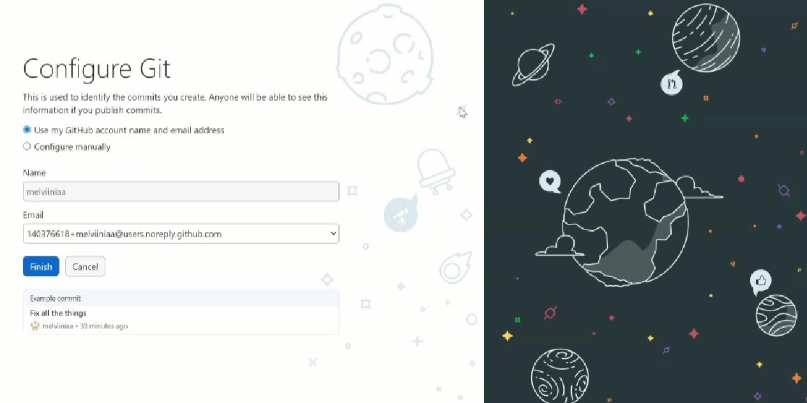
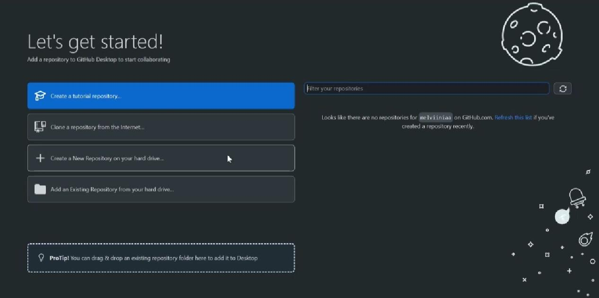

# **CARA INSTALL APLIKASI GITHUB DESKTOP**
-------------------------------------------

## Apa itu GitHub Desktop
Deskop Github adalah aplikasi buatan github yang berfungsi untuk mempermudah menggguna untuk upload file dan project.

## Kelebihan dan Kekurangan dari GitHub Desktop
Kelebihan :

* Atribut berkomitmen dengan kolaborator dengan mudah
  Tambahkan rekan penulis dengan cepat ke komit Anda. Sangat cocok untuk dipasangkan dan sangat baik untuk mengirimkan sedikit cinta/kredit kepada seseorang yang spesial yang membantu memperbaiki bug Anda yang buruk itu. Lihat atribusi di halaman riwayat, batalkan atribusi yang tidak disengaja, dan lihat rekan penulis di github.com
* Gambar Daftar Permintaan Tarik dan Fitur Pemeriksaan CI
  Periksa cabang dengan permintaan tarik dan lihat status CI
  Lihat semua permintaan tarik terbuka untuk repositori Anda dan periksa seolah-olah itu adalah cabang lokal, bahkan jika itu dari cabang atau cabang hulu. Lihat permintaan tarik mana yang lulus pemeriksaan status komit juga!
* Gambar Fitur Perbedaan Sintaks yang Disorot
  Perbedaan sintaks yang disorot
  Desktop GitHub baru mendukung penyorotan sintaks saat melihat perbedaan untuk berbagai bahasa yang berbeda.
* Ikon yang mewakili file gambar
  Dukungan perbedaan gambar yang diperluas
  Bandingkan gambar yang diubah dengan mudah. Lihat sebelum dan sesudah, geser atau pudar di antara keduanya, atau lihat hanya bagian yang diubah.
* Ikon yang mewakili terminal
  Integrasi editor & shell yang luas
  Buka editor atau shell favorit Anda dari aplikasi, atau kembali ke GitHub Desktop dari shell Anda. GitHub Desktop adalah batu loncatan Anda untuk bekerja.
* Ikon yang mewakili organisasi
  Komunitas didukung
  GitHub Desktop adalah open source sekarang! Lihat peta jalan kami, berkontribusi, dan bantu kami membuat kolaborasi menjadi lebih mudah.

  Kekurangan : 
  * Tidak terlalu native, karena menggunakan Electron sebagai basisnya
  * Hanya mendukung platform Github, yang lain sudah bisa dipakai untuk Gitlab, Bitbucket dkk loh
  * Ngga bisa bikin Group Project, hehe, kalau mengelola cukup banyak repo bakalan ribet!

  ## Cara Install GitHub Desktop di laptop
  Aplikasi deskop github untuk window hanya support indow 64 bit , jika kamu menggunakna window 32 bit , tidak bisa menggunakan aplikasi Github Deskop ini.

1. Buka Aplikasi Google Chrome pada laptop/pc anda, ketik 'Download GitHub Desktop' atau click situs ini [GitHub.Desktop](https://desktop.github.com/)

  

  maka akan keluar tampilan seperti ini

  

2. Click 'Download for Windows(64bit)' lalu tunggu beberapa saat untuk menginstall.

    

3. Jika sudah selesai, maka anda bisa membuka file anda dan click untuk membuka aplikasi.

   

   

4. Setelah anda membuka file dan meng-Click file aplikasi tersebut, maka akan keluar tampilan seperti ini.

  

  Lalu click 'Sign.in to GitHub.com' ( Jika kalian sudah pernah login di GitHub.web sebelumnya ).

5. Otomatis aplikasi akan berpindah ke halaman berikutnya, maka anda bisa mengisi email dan password tapi sebelum itu pastikan jika email yang anda masukkan masih aktif dan password yang anda masukkan juga valid.

  

  Setelah selesai memasukkan email dan password, anda bisa meng-Click tombol dibawahnya yang bertuliskan 'Sign.in'

6. Jika berhasil maka akan tampil halaman seperti ini.

  

  Dan anda bisa meng-Click 'Authorize Desktop'

7. Maka GitHub akan mengonfirmasi, dan anda bisa meng-Click 'Buka' atau semacamnya.

  

8. Otomatis GitHub Desktop akan terbuka seperti ini

  

   Click finish untuk masuk ke halaman utama GitHub Desktop.

9. Tunggu beberapa saat, dan GitHub Desktop siap digunakan.

  