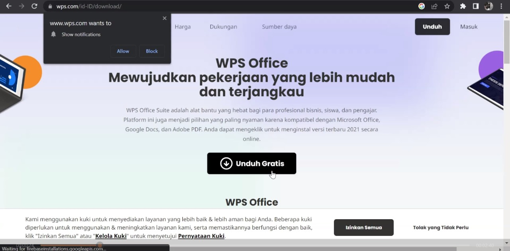
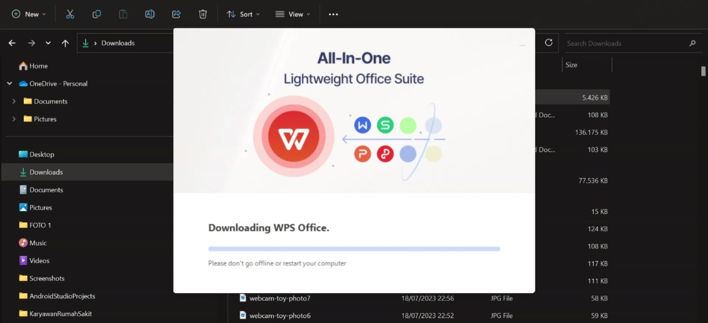
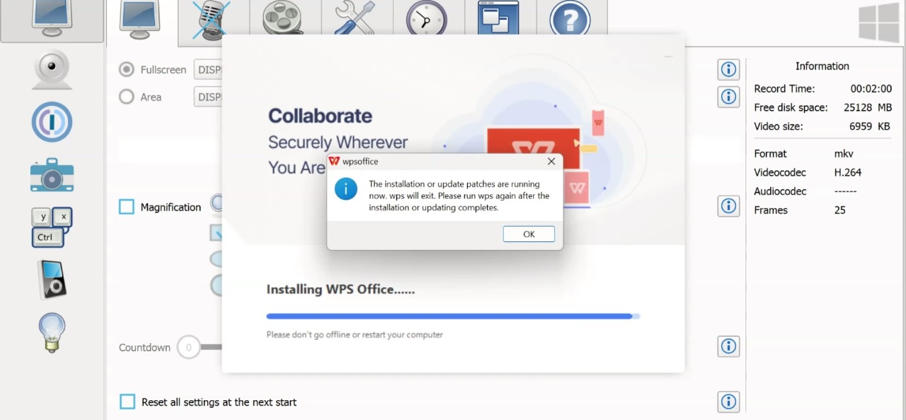
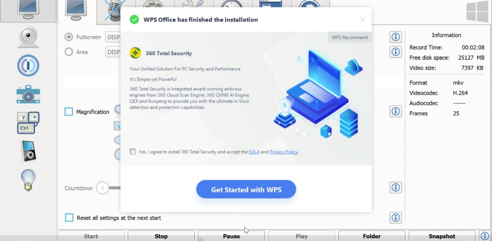
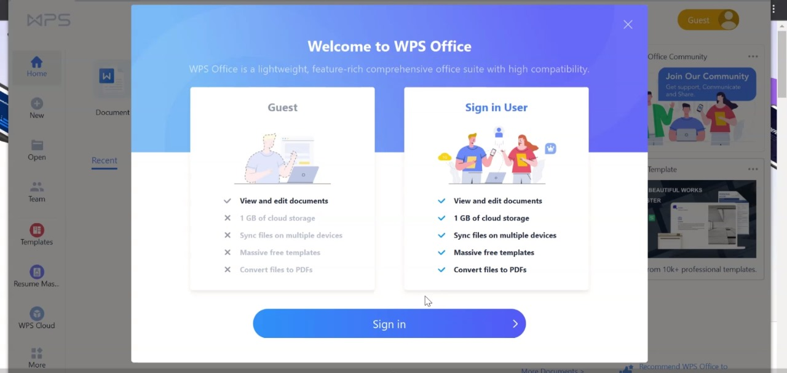
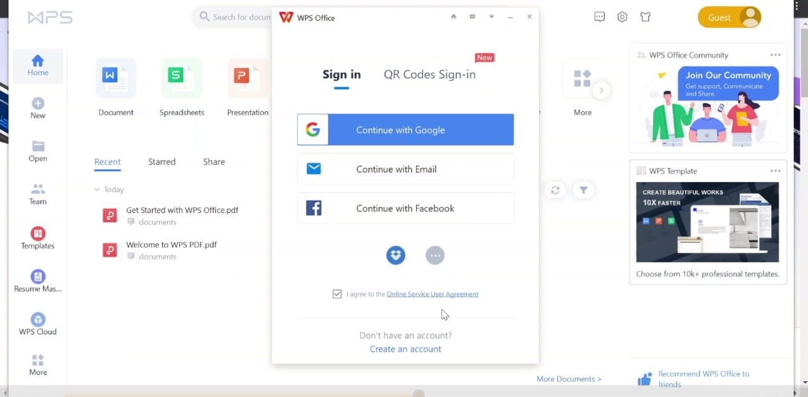
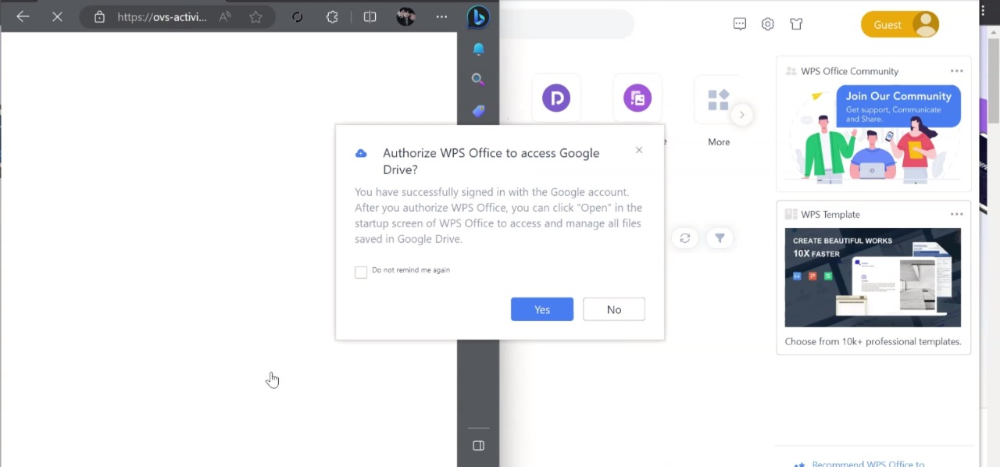

# **CARA MENGINSTALL WPS OFFICE**

## Apa itu WPS Office?

WPS Office adalah suatu aplikasi yang memiliki beberapa layanan seperti writer, spreadsheet, dan presentation. Sebelum menggunakan nama WPS Office, aplikasi ini bernama Kingsoft Office.

Dukungan dari WPS Office meliputi berbagai perangkat seperti Microsoft Windows, iOS, Linux, dan juga Android OS.

Apa Gunannya WPS Office?

WPS Office merupakan sebuah aplikasi multifungsi. Tidak dapat dipakai untuk membaca dokumen, tetapi juga dapat dipakai untuk membuat, mengedit, melihat, dan juga berbagi dokumen gratis dan mudah. 

## Keunggulan dan Kelemahan aplikasi WPS Office

* WPS Office memiliki fitur reading dengan tampilan layout yang dapat di-scroll atas ke bawah atau sebaliknya. Selain itu bisa juga
  menggunakan mode flip yang memungkinkan penggunanya membaca artikel; yang ada dengan cara membalikkan halaman seperti pada buku.
* Fitur memperbesar layar dengan tulisan yang bisa kamu wrap agar apa yang ingin kamu baca tidak terpotong oleh bagian tepi layar
  laptopmu.
* Ukuran yang kecil memudahkan penggunaannya bagi pengguna yang memiliki spesifikasi laptop atau PC tidak terlalu tinggi. Dengan ukuran
  aplikasi yang kecil, ruang penyimpanan pada perangkatmu tidak banyak terkuras.
* Penggunaan RAM yang minim akan memperlancar aplikasi WPS Office ketika digunakan. Kamu tidak akan mengalami gangguan seperti lag pada
  saat menggunakan WPS Office yang akan berdampak pada ketidaknyamananmu saat menggunakan aplikasi ini.
* Memiliki fitur mengconvert file ke dalam bentuk PDF seperti pada Microsoft Word. Fitur ini tentunya akan sangat membantumu untuk
  mengonversi beberapa file yang kamu butuhkan ke dalam bentuk PDF agar susunan file tersebut tidak berubah ketika dibuka menggunakan perangkat lain.
* Tampilan sederhana yang sangat mudah untuk digunakan pada aplikasi WPS Office membuat pengguna baru yang ingin mencoba aplikasi ini
  tidak akan mengalami kesulitan.
* Pengaturan Bullet dan Numbering yang sangat mudah untuk digunakan bagi pengguna aplikasi WPS Office pada versi Android.
* Pada versi Android terdapat tombol yang dapat digunakan untuk menampilkan dan menyembunyikan keyboard. Bagi yang ingin membaca preview
  dari tulisan yang kamu ketik, bisa menggunakan tombol ini untuk menghilangkan keyboard pada layarmu.
* Ada beberapa gambar yang tidak dapat dibuka pada WPS Presentation. Untuk membukanya, kamu perlu klik gambar beberapa kali agar muncul
  pada layar kamu.

  ## Cara Install WPS Office Desktop

 1.  Buka Google Chrome ketik 'download wps office' atau click situs [WPS.Office](https://www.wps.com/id-ID/download/) maka akan muncul
     halaman seperti gambar dibawah ini,

Lalu click 'Unduh Gratis' tunggu beberapa saat hingga proses penginstallan selesai.

2. Setelah selesai, buka file folder dan click file yang telah terinstall tadi, dan tunggu beberapa saat.

3. Lalu click 'Ok' untuk menginstall aplikasi tersebut di laptop/pc kamu 

4. Click 'Get Started with WPS' untuk membuka aplikasi WPS Office.

5. Dan WPS Office sudah terinstall di pc/laptop kamu.

## Cara Login Aplikasi WPS Office

1. Buka aplikasi WPS Office kamu, click ikon pada pojok kanan atas lalu click 'Sign in'.

2. Kamu bisa login melalui google, email, atau facebook.

3. Jika kamu login/masuk menggunakan google maka click google dan pilih akun yang akan kamu pakai, dan isi negara sesuai tempat tinggal kalian sekarang.

4. Maka akan ada pemberitahuan tentang WPS Office akan minta konfirmasi, contohnya seperti ini

Kamu bisa mengclick 'Yes' untuk mengonfirmasi setuju pada WPS Office.

5. Dan kamu sudah login pada WPS Office