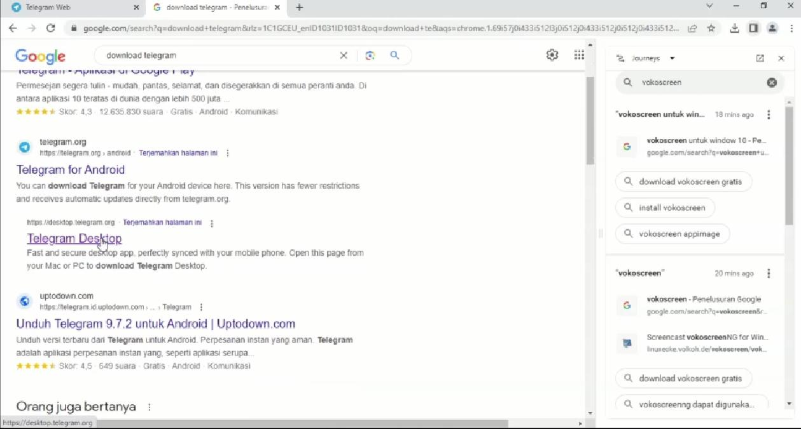
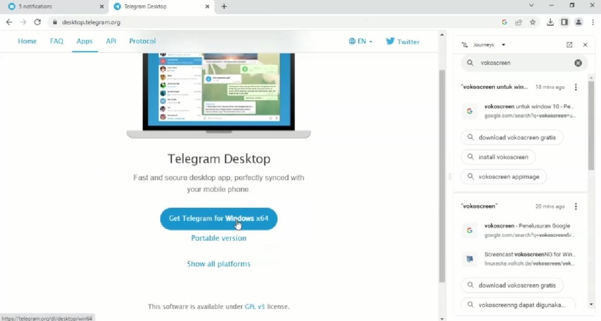
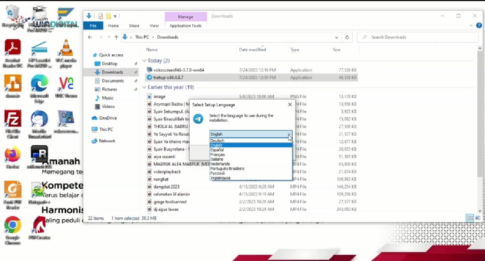
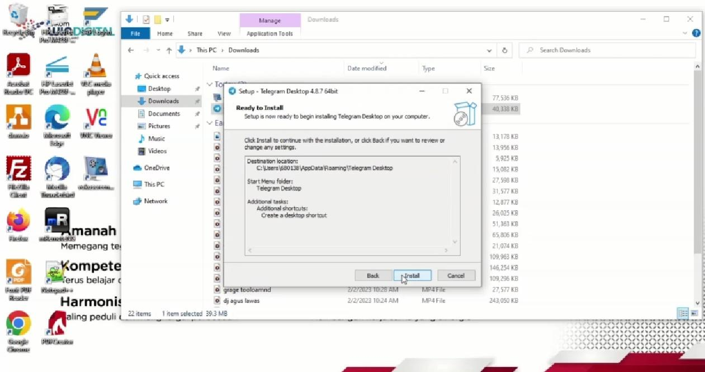
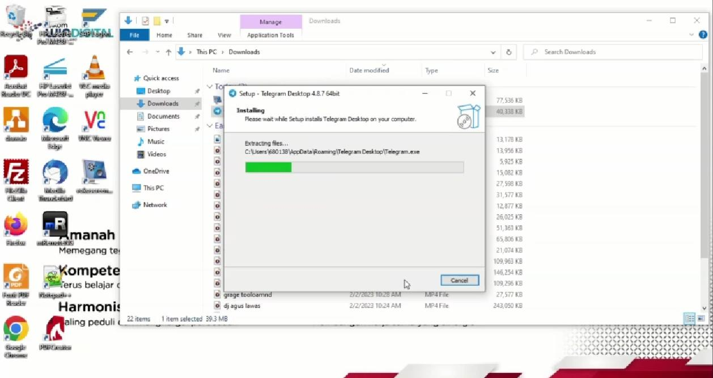
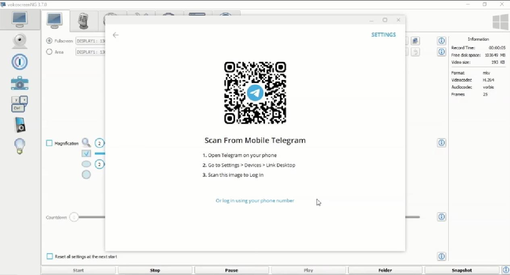
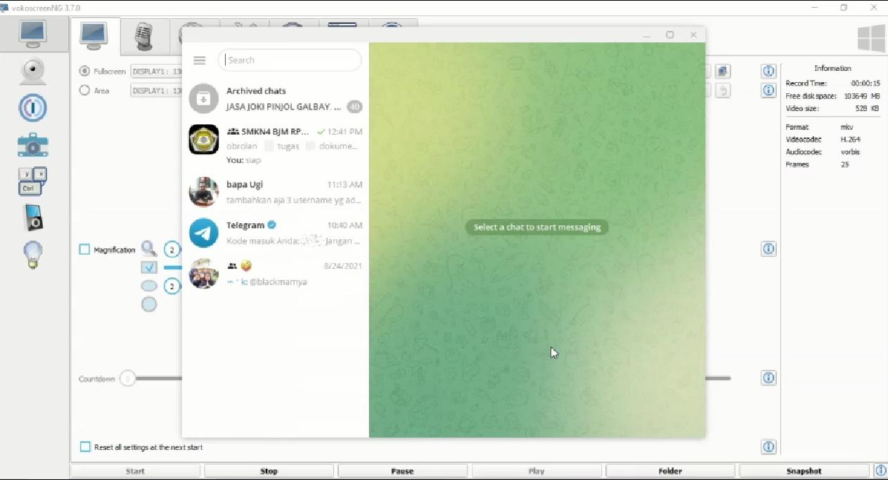

# **TELEGRAM DESKTOP**

### Daftar Judul
1. Daftar Isi
2. Persiapan Awal
3. Cara Menginstall dan Login aplikasi Telegram Dekstop
4. Cara Mudah Download Telegram
    **Install dan Login Telegram**
   - Masuk ke beranda situs Download Telegram Desktop
   - Download sesuai versi yang di butuhkan
   - Masuk ke beranda situs Download Telegram Desktop
   - Masuk menggunakan QR/No Handphone
   - Lengkapi data pendaftaran
   

### Daftar Isi
Untuk mendaftar github diperlukan beberapa tahap sebagai berikut :
1. Daftar Judul
1. Persiapan Awal
1. Masuk ke beranda situs Download Telegram Desktop
1. Download sesuai versi yang di butuhkan
1. Masuk menggunkan code QR atau No Handphone
1. Lengkapi data pendaftaran

### Persiapan awal
- Jaringan cepat 
  Untuk mendaftar Telegram diperlukan No Handphone aktif untuk masuk/login.
- kode OTP
- Username

#### Masuk ke beranda situs Download Telegram Dekstop
...
#### Download sesuai versi yang di butuhkan
...
#### Masuk menggunkan code QR atau No Handphone
...
#### Lengkapi data pendaftaran

## Cara Menginstall dan Login aplikasi Telegram Dekstop
Telegram adalah salah satu aplikasi layanan komunikasi yang banyak digunakan orang selain WhatsApp. Ada beberapa aspek yang membuat Telegram menjadi andalan untuk berkirim pesan, nih.

Mulai dari penggunaannya yang mudah, kualitas foto atau video nggak berkurang, ada fitur mengedit pesan, grup yang bisa memuat 5.000 orang, sampai bisa mengirim file dengan ukuran besar hingga 2 GB. Nggak heran kalau banyak kantor sampai grup pertemanan yang mengandalkan aplikasi Telegram ini.

Nggak hanya bisa mengaksesnya di handphone, kamu juga bisa login via Telegram web, lho. Kamu bisa men-download aplikasi Telegram di laptop ataupun membukanya langsung di browser.

Berikut ini tips mudah yang bisa kamu lakukan untuk download aplikasi, login, dan logout Telegram web, biar nggak bingung lagi!

## Cara Mudah Download Telegram

Cara pertama untuk mengakses Telegram di laptop adalah dengan men-download aplikasinya. Ada beberapa langkah mudah yang bisa kamu ikuti, nih.

* Pertama, kamu bisa membuka situs desktop [Telegram.Dekstop](https://desktop.telegram.org/).

* Pilih versi yang kamu inginkan, dan klik download Get Telegram for windows x64.

* Tunggu hingga aplikasi Telegram berhasil di-install. Nah, kalau aplikasi Telegram sudah ter-install, kamu bisa mengubah bahasa sesuai yang ingin kamu inginkan, seperti pada gambar di bawah ini. 

 

* Selanjutnya Kamu bisa click 'Next' secara berurutan dan ada sekitar 3 slide, sampai menampilkan 'Install' Kamu bisa langsung meng-click agar apliksi Telegram Dekstop bisa muncul di windows mu, dan tunggu untuk beberapa saat sampai windows mu selesai menginstall.

 

* Kalau proses instal sudah selesai, kamu bisa langsung mulai menggunakan aplikasi itu dengan mengklik “Start Messaging”, kamu bisa login menggunakan nomor telpon atau kode qr.

* Kamu sudah bisa mulai mengirim pesan memakai Telegram Dekstop

* Untuk login dengan nomor telpon akan ada kode verifikasi dari Telegram ke nomor telpon Kamu. Masukkan kode itu ke aplikasi Telegram di
  laptop. Kalau sudah terverifikasi, kamu sudah bisa mulai mengirim pesan pakai Telegram di dekstop, deh!
