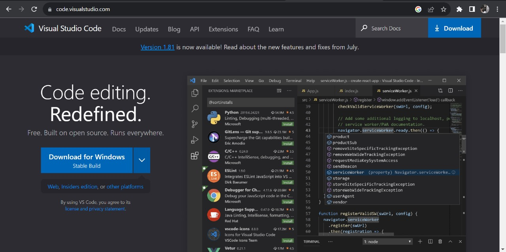
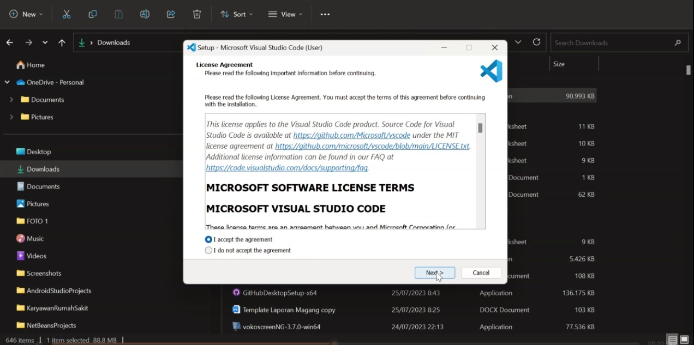
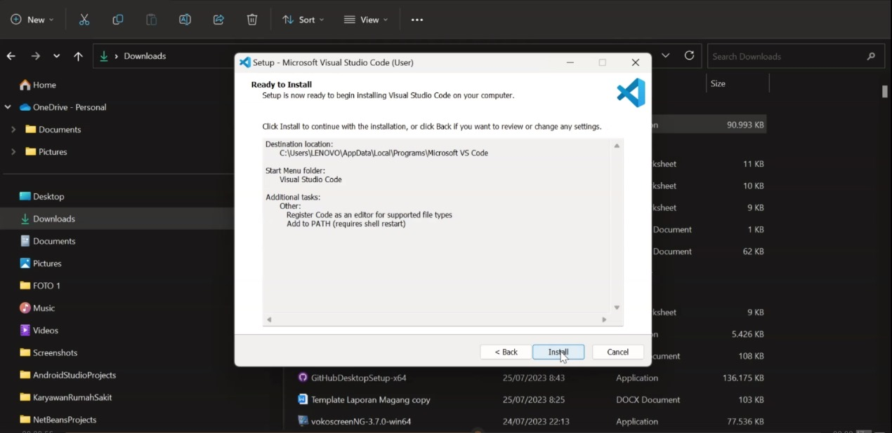
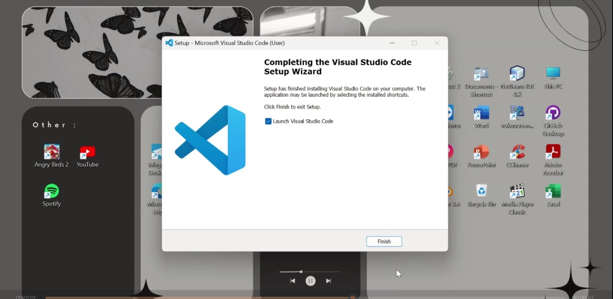
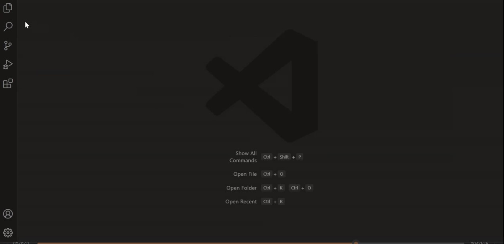

# **INSTALL APLIKASI VSCODE ATAU VISUAL STUDIO CODE**
-----------------------------------------------------

### Daftar Judul
1. Daftar Isi
2. Persiapan Awal
3. Apa itu vscode atau visual studio code?
4. Jenis-jenis Visual Studio.
5. Fitur Visual Studio Code.
6. Keunggulan Visual Studio Code.
7. Cara Install Visual Studio Code
    **Install Vscode**
   - Masuk ke beranda situs Download Vscode
   - Download sesuai versi yang di butuhkan
   - Tunggu sampai proses pendownload-an selesai
8. Ikhtisar
   

### Daftar Isi
Untuk mendaftar github diperlukan beberapa tahap sebagai berikut :
1. Daftar Judul
1. Persiapan Awal
1. Masuk ke beranda situs Download Vscode
1. Download sesuai versi yang di butuhkan
1. Tunggu sampai proses pendownload-an selesai

### Persiapan awal
- Jaringan stabil 
  Untuk mendownload Vscode diperlukan Jaringan yang stabil.

#### Masuk ke beranda situs Download Vscode
...
#### Download sesuai versi yang di butuhkan
...
#### Tunggu sampai proses pendownload-an selesai

Istilah code editor mungkin terdengar tidak asing bagi kamu yang bergelut di bidang IT khususnya application developer. Sayangnya, kebanyakan code editor minim fitur sehingga membutuhkan beberapa aplikasi tambahan. Nah, jika kamu mencari editor berfitur lengkap serta mendukung banyak bahasa pemrograman, Visual Studio Code adalah solusinya.

Visual Studio Code dibekali segudang fitur mumpuni yang tidak dimiliki software editor sejenis lainnya. Software ini sangat populer dan digunakan secara luas oleh para developer untuk membuat aplikasi, baik android, iOS, website, maupun machine learning.

## Apa itu vscode atau visual studio code?

Visual Studio Code adalah aplikasi code editor buatan Microsoft yang dapat dijalankan di semua perangkat desktop secara gratis. Kelengkapan fitur dan ekstensi membuat code editor ini menjadi pilihan utama para pengembang. Visual Studio Code bahkan mendukung hampir semua sistem operasi seperti Windows, Mac OS, Linux, dan lain sebagainya.

Aplikasi ini juga bisa dijalankan untuk membuat atau mengedit kode sumber berbagai programming language. Sebut saja seperti Node.js, JavaScript, TypeScript, dan masih banyak lagi.

Selain itu, Visual Studio Code menawarkan ekstensi dan ekosistem yang cukup luas. Hal ini membuatnya memiliki kompatibilitas tinggi dengan bahasa atau runtime environment lain, di iantaranya termasuk bahasa pemrograman Python, PHP, .NET, dan Java.

## Jenis-jenis Visual Studio 

Visual Studio adalah software yang digunakan untuk menulis sintak ketika membuat suatu aplikasi. Setidaknya ada empat jenis Visual Studio yang harus kamu ketahui, di antaranya IDE, App Center, Azure DevOps, dan Visual Studio Code. Untuk memudahkan pemahamanmu, simak ulasannya di bawah ini:

* **Visual Studio IDE** – Software ini digunakan untuk membuat
    aplikasi secara cepat dengan komponen penyelesaian kode baik sebagai source level maupun machine level.
* **Visual Studio App Center** – Software ini lebih mengarah ke
    otomatisasi life cycle aplikasi-aplikasi yang berjalan di beberapa operating system seperti iOS, android, Windows, dan Mac.
* **Azure DevOps** – Sebagai evolusi dari Visual Studio Team
    Service (VSTS), Azure DevOps memudahkan pengguna ketika membangun aplikasi. Terdapat sejumlah fasilitas pendukung guna mengoptimalkan proyek. Misalnya, Azure Boards untuk perencanaan, Azure Repos untuk manajemen file, Azure Test Plan untuk uji aplikasi, dan sebagainya.
* **Visual Studio Code** – Sebelumnya Dewaweb sudah menjelaskan
    software ini cukup jelas. Sederhananya, Visual Studio Code adalah code editor open-source (gratis) yang bisa dijalankan di berbagai sistem operasi untuk membangun aplikasi.

## Fitur Visual Studio Code

* **Basic Editing**

  Fitur sekaligus fungsi utama Visual Studio Code tentu saja untuk melakukan coding. Fitur basic editing software ini merupakan salah satu yang terlengkap di kelasnya. Visual Studio Code menawarkan berbagai formatting code hingga fitur auto-save demi menunjang kebutuhan pengguna.

  Selain itu, proses editing akan terasa lebih nyaman, cepat, dan praktis dengan adanya sejumlah hotkey untuk melakukan perintah-perintah tertentu.

* **Debugging**

Fitur debugging berfungsi untuk memudahkan pengguna mengolah program yang sedang dibuat. Dalam hal ini termasuk mengedit, menyusun, dan mengeksekusi code berulang kali dalam waktu singkat. Tak perlu khawatir jika terjadi kesalahan ketika menulis kode, error message terlihat sangat jelas sehingga kamu dapat mengetahui dimana letak kesalahannya.

* **Extension Marketplace**

Adanya fitur extension marketplace memungkinkan pengguna mengeksplorasi dan menambahkan komponen-komponen lain di luar Visual Studio Code. Kamu dapat menginstal tools atau ekstensi apapun secara cepat tanpa harus memikirkan detail konfigurasi. Ada banyak ekstensi populer yang bisa kamu unduh, misalnya ESLint, Prettier, Live Server, Vetur, Debuggers, dan masih banyak lagi.

* **IntelliSense**

Menulis seluruh kode program dari awal sampai akhir tentu sangat melelahkan, bukan? Untuk mengatasi ini, kamu dapat memanfaatkan fitur IntelliSense yang dijamin membuat semua aktivitas coding terasa jauh lebih nyaman. Fitur ini sudah tertanam otomatis pada Visual Studio Code dan berfungsi untuk memunculkan sugesti possible code berdasarkan bahasa atau database yang digunakan.

Secara default, IntelliSense hanya mendukung bahasa pemrograman HTML, CSS, JavaScript, dan TypeScript. Di luar bahasa tersebut, kamu bisa mengunduh IntelliSense khusus melalui extension marketplace jika ingin menggunakan bahasa pemrograman lain.

* **Github Integration**

Visual Studio Code memberikan banyak opsi integrasi repository tanpa ribet. Salah satunya adalah Github yang merupakan project management platform paling populer di dunia. Dengan platform ini, kamu dapat berkolaborasi dan berbagi kode dengan rekan tim dalam satu wadah.

## Keunggulan Visual Studio Code

* Fitur Lengkap dan Gratis 
* Ringan
* Mendukung Banyak Bahasa Pemograman
* Performa Cepat
* Multiplatform

## Cara Install Visual Studio Code

1. Buka Google Chrome atau click situs [Vscode.com](https://code.visualstudio.com/) maka situs akan terbuka seperti gambar berikut,

Click 'Download for Windows' untuk langsung mendownload aplikasi Visual Studio Code dan tunggu beberapa saat hingga pendownloadan selesai.

2. Setelah selesai, buka file forder dilaptop kamu, click file yang kamu download tadi

Sampai terbuka dan menampilkan halaman seperti ini.

3. Jika sudah kamu bisa meneruskan ke halaman berikutnya dengan menekan/mengclick tombol 'next' secara terus menerus tetapi kamu juga bisa mengatur beberapa semacam fitur sesuai yang kamu mau, sampai akhirnya tampil halaman seperti ini,

Click 'Install' untuk memasang aplikasi pada laptop mu, dan tunggu beberapa saat sampai proses penginstallan selesai.

4. Jika sudah selesai maka akan muncul halaman seperti ini,

click 'Finish' untuk melanjutkan ke aplikasi vscode.

5. Aplikasi Vscode atau Visual Studio Code siap dipakai

## Simpulan

Sejauh ini kamu tentu sudah paham apa itu Visual Studio Code mulai dari jenis, fitur, hingga keunggulannya. Visual Studio Code adalah software code editor gratis buatan Microsoft yang bisa dijalankan di berbagai operating system pada perangkat desktop. Aplikasi ini mendukung hampir semua bahasa pemrograman seperti Node.js, JavaScript, TypeScript, dan lain sebagainya. Sudah siap menggunakan Visual Studio Code?  
