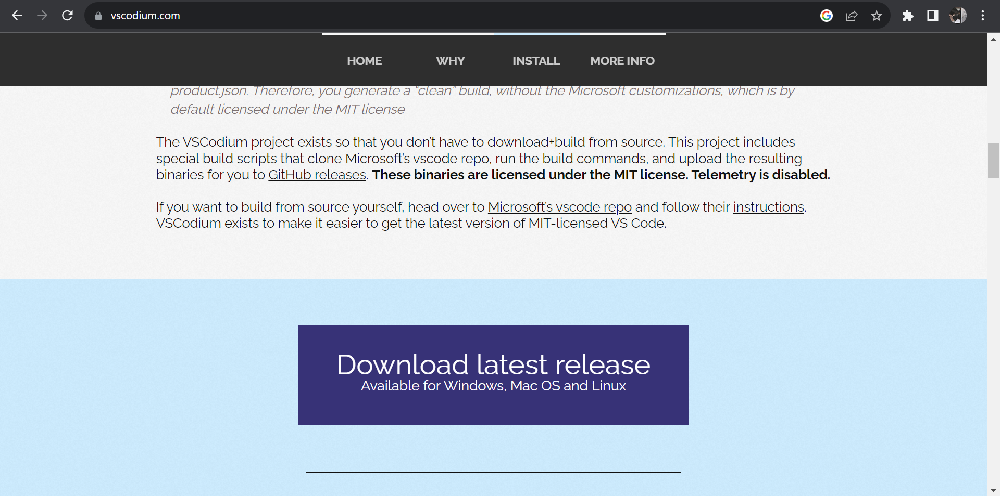

# **CARA INSTALL CODIUM ATAU VSCODIUM**
----------------------------------------

### Daftar Judul
1. Daftar Isi
2. Persiapan Awal
3. Apa itu Vscodium? 
4. Bagaimana cara Menginstallnya?
   - Masuk ke beranda situs Download Vscodium
   - Download sesuai versi yang di butuhkan
   - Tunggu sampai proses pendownload-an selesai

   

### Daftar Isi
Untuk mendaftar github diperlukan beberapa tahap sebagai berikut :
1. Daftar Judul
1. Persiapan Awal
1. Masuk ke beranda situs Download Vscodium
1. Download sesuai versi yang di butuhkan
1. Tunggu sampai proses pendownload-an selesai

### Persiapan awal
- Jaringan stabil 
  Untuk mendownload Vscodium diperlukan Jaringan yang stabil.

#### Masuk ke beranda situs Download Vscodium
...
#### Download sesuai versi yang di butuhkan
...
#### Tunggu sampai proses pendownload-an selesai

## Apa itu Vscodium? 

VSCodium adalah build VSCode yang bersih tanpa kustomisasi Microsoft. Kode Visual Studio Microsoft dengan cepat menjadi salah satu IDE paling populer di pasar. Faktanya, dalam Survei Pengembang Stack Overflow 2019 baru-baru ini, Visual Studio Code menduduki peringkat alat lingkungan pengembang paling populer.

## Bagaimana cara Menginstallnya?

* Buka Google Chrome atau Click situs [Vscodium.com](https://vscodium.com/) maka akan terbuka seperti ini

  Setelah itu kamu bisa scroll ke bawah sedikit untuk menemukan tombol Download seperti di bawah ini 

* Setelah kamu mengclick tombol tersebut, otomatis akan berganti ke halaman berikutnya

( Kamu bisa scrool ke bawah dan cari versi 1.80 apabila bukan versi 1.80 yang muncul pertama)

Kamu bisa Click 'VSCodiumSetup-x64-1.80.1.23208.exe' dan tunggu beberapa saat selagi mendownload

* Setelah selesai, kamu bisa membuka di File folder kamu dan click file yang baru kamu download tadi. Maka akan keluar seperti ini

* Jika sudah terbuka seperti itu, click 'run away' dan tunggu. Sampai terbuka halaman seperti ini

Kamu bisa meclick tombol 'Next' dan jangan lupa ubah pilihan mu menjadi 'I accept the aggrement' slide selanjutnya kamu bisa meclick 'Next' untuk semua pernyataan ( Kamu juga bisa mengubah beberapa fitur sesuai yang kamu inginkan ).

* Setelah itu apabila ada muncul slide/halaman seperti contoh berikut

Kamu bisa click 'Install' untuk memasang aplikasi vscodium di pc/laptop mu, dan tunggu untuk beberapa saat selagi pc/laptop mu menginstall

* Jika sudah terinstall, halaman akan berganti seperti ini, kemudian Click finish untuk melanjutkan ke halaman utama aplikasi Vscodium

* Vscodium sudah bisa dipakai!

