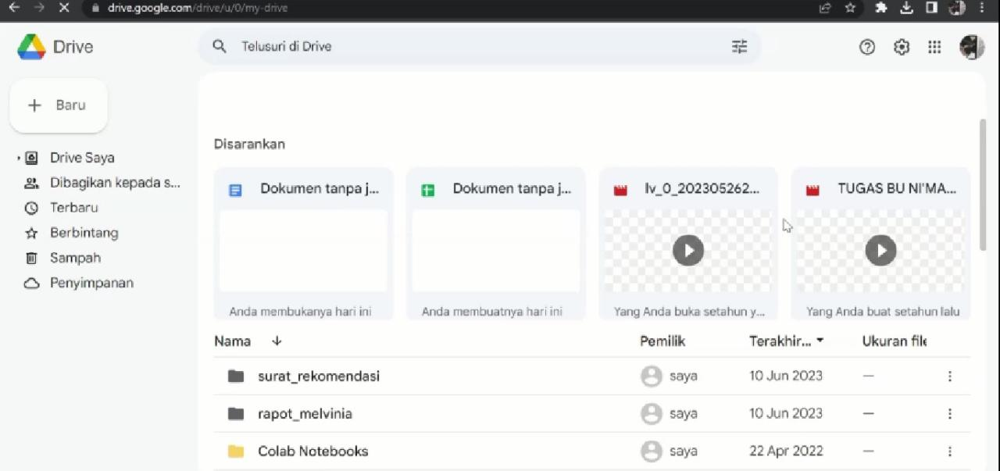
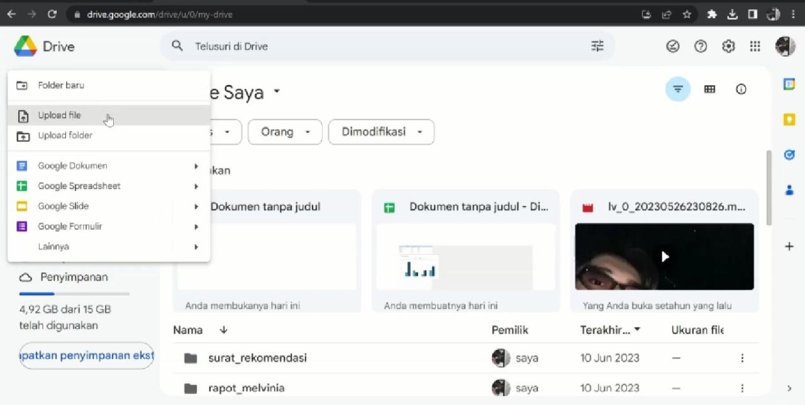
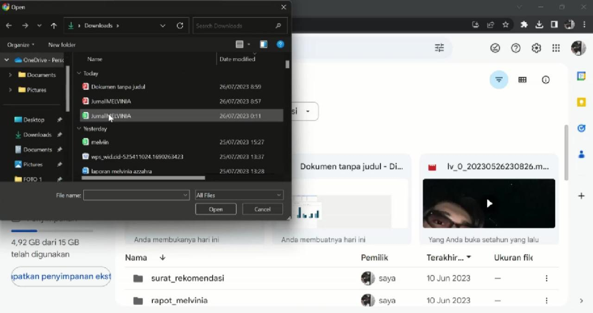
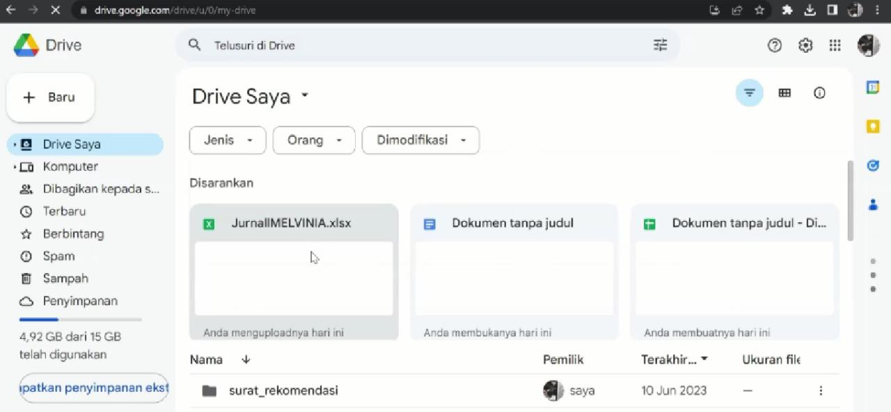

# **MEMINDAHKAN FILE DARI WPS KE SPREADSHEET GOOGLE**
--------------------------------------------------------

### Daftar Judul
1. Daftar Isi
2. Persiapan Awal.
3. Bagaimana cara memindahkan File WPS ke Spreadsheet Google?
4. Fungsinya Spreadsheet apasih, dan apa bedanya sama Microsoft Excel?
5. Kelebihan Spreadsheet Google.
6. Kekurangan Spreadsheet Google.
7. Cara memindahkan File dari WPS ke Spreadsheet. 
   - Masuk ke Aplikasi WPS Office.
   - Simpan/Download File yang ingin kamu pindahkan ke Spreadsheet.
   - Tambahkan File yang kamu download tadi ke Google Drive.

### Daftar Isi
Untuk mendaftar github diperlukan beberapa tahap sebagai berikut :
1. Daftar Judul
1. Persiapan Awal
1. Masuk ke Aplikasi WPS Office.
1. Simpan/Download File yang ingin kamu pindahkan ke Spreadsheet.
1. Tambahkan File yang kamu download tadi ke Google Drive.

   

### Persiapan awal
- Jaringan Lancar 
  Untuk menambahkan/membuka File ke Google Drive diperlukan Jaringan yang lancar dan cepat.
- Akun Google

####  Masuk ke Aplikasi WPS Office.
...
#### Simpan/Download File yang ingin kamu pindahkan ke Spreadsheet.
...
#### Tambahkan File yang kamu download tadi ke Google Drive.

## Bagaimana cara memindahkan File WPS ke Spreadsheet Google?
Sebelumnya apakah kamu tahu tentang apa itu WPS dan Spreadsheet Google? Di sini saya akan menjelaskan sedikit tentang WPS dan Spreadsheet Google. Apa itu WPS? WPS Office adalah sebuah paket aplikasi perkantoran untuk Microsoft Windows, Linux, iOS, dan Android OS, yang dikembangkan oleh pengembang perangkat lunak dari Tiongkok yang berbasis di Zhuhai, yaitu Kingsoft. WPS Office juga memiliki beberapa layanan seperti writer, spreadsheet, dan presentation.

Sedangkan Spreadsheet Google adalah progam lembatang sebar yang disertakan sebagai bagian dari rangkaian Google Docs Editor berbasis web bebas yang ditawarkan oleh Google. Layanan ini juga mencakup Google Docs, Google Slides, Google Gambar, Google Formulir, Google Sites, dan Google Keep.

## Fungsinya Spreadsheet apasih, dan apa bedanya sama Microsoft Excel?

 Saya akan membahasnya satu-persatu, ya! Google Sheets adalah perangkat lunak atau software yang dikembangkan Google untuk membuat tabel, perhitungan sederhana, dan manipulasi data, mirip Microsoft Excel. Dengan penyimpanan berbasis cloud, Kamu bisa menggunakan Spreadsheet secara gratis dan berkolaborasi bersama tim Kamu! 

Oke, sekarang perbedaan Spreadsheet Google sama Microsoft Excel ya! Salah satu perbedaan utama antara Microsoft Excel dan Google Sheets adalah aksesibilitasnya. Microsoft Excel adalah program desktop yang harus diinstal pada komputer, sedangkan Google Sheets adalah aplikasi web yang dapat diakses melalui browser web mana pun.

## Kelebihan Spreadsheet Google

*     Berbasis Cloud Storage
Pada dasarnya Google Spreadsheet adalah software yang berbasis internet atau cloud. Sehingga membuat penggunaannya lebih mudah dan tidak memakan ruang penyimpanan di komputer Anda.

Dengan adanya cloud storage tentu saja Anda tidak perlu takut akan kehilangan file yang disebabkan oleh komputer mati mendadak, koneksi hilang, listrik padam dan lain-lain. Sebab, apa yang sudah Anda kerjakan, secara otomatis akan langsung tersimpan ke dalam cloud storage.

*   Lebih Ringan

Karena berbasis internet, tentu saja Anda tidak perlu mengunduh software tersebut untuk diinstal ke dalam komputer. Hal ini akan meringankan kinerja dari perangkat yang Anda gunakan.

Anda bisa langsung mengakses Google spreadsheet adalah melalui browser, kemudian membuka file tersebut dari cloud storage. Hal ini tentu sangat menguntungkan bagi pelajar atau pekerja yang memang tidak terlalu banyak membutuhkan fungsi dari penggunaan Spreadsheet.

*     Lebih Fleksibel
Keunggulan dari Google Sheets selanjutnya bisa dilihat dari segi fleksibilitasnya dimana Anda bisa mengaksesnya melalui berbagai perangkat dan sistem operasi, misalnya dari ponsel atau desktop. Bisa juga menggunakan berbagai sistem operasi yang Anda pilih.

Tidak hanya itu saja, Anda bisa langsung memberikan dan menerima feedback yang diberikan secara online. Sebab, Google Sheets bisa digunakan dengan anggota dari tim Anda secara online.

*     Gratis
Untuk bisa menikmati berbagai fitur yang ditawarkan Google Sheets ini, Anda tidak perlu membayarnya. Meskipun ada beberapa fitur berbayar, tetapi tidak terlalu diperlukan untuk pekerja dan pelajar harian.

## Kekurangan Spreadsheet Google

*     Extensi Penyimpanan
Berbicara mengenai extensi penyimpanan, seperti yang Anda ketahui bahwa extensi yang di hasilkan oleh file spreadsheet Microsoft Excel adalah adalah .xlsx, .xls, .csv, .txt, dan .pdf. Tentu beragam pilihan extensi tersebut membuat Excel lebih unggul.

Berbeda dari extensi yang di hasilkan oleh file spreadsheet adalah .xlsx, .pdf, .html, .ods, dan .tsv. Sehingga memang lebih terbatas daripada extensi yang dihasilkan oleh Microsoft Excel.

*     Fitur Profesional Lebih Terbatas
Bagi Anda yang memang sehari-harinya pekerjaannya hanya berkutat dengan angka dan data secara khusus, tentu Google Sheets masih cukup terbatas. Sebab, fitur profesional yang disediakan memang belum selengkap Excel.

Salah satu contohnya adalah fitur forecasting, dimana penggunaan fungsi ini menjadi sangat dibutuhkan untuk profesi tertentu.

*     Membutuhkan Jaringan Internet
Kekurangan lain dari penggunaan Google spreadsheet adalah harus selalu terhubung ke jaringan internet yang stabil. Kestabilan jaringan internet yang Anda gunakan sangat berpengaruh pada kelancaran pengerjaan Google Sheets.

Nah, sudah cukup jelaskan? Oke, pertama tujuan dan maksud saya membuat dokumentasi ini adalah saya ingin mengolah tatacara atau tutorial cara memindahkan file dari WPS ke Spreadsheet, Oke langsung saja, Check it out.

## Cara memindahkan File dari WPS ke Spreadsheet

1. Kamu bisa membuat file Spreadsheet di WPS Office kemudian download/save File Spreadsheet WPS tersebut ke dalam File Folder kamu ( ctrl+s ) terlebih dahulu.
2. Setelah itu kamu bisa beralih ke Google Chrome pada pc/laptop mu, dan buka Google Drive

3. Lalu kamu bisa click '+BARU' pada pojok kiri atas tersebut dan pilih 'Upload File'

4. Selanjutnya Pilih File tadi yang ingin kamu pindahkan ke Spreadsheet, contohnya.

5. Tunggu beberapa saat untuk mengupload File tersebut ke Spreadsheet Google, jika sudah terupload maka kamu bisa merefresh halaman Google Drive tersebut dan akan muncul file yang sudah kamu upload tadi.

Kamu sudah bisa mengedit atau mengubah lainnya sekarang di Google Spreadsheet.

