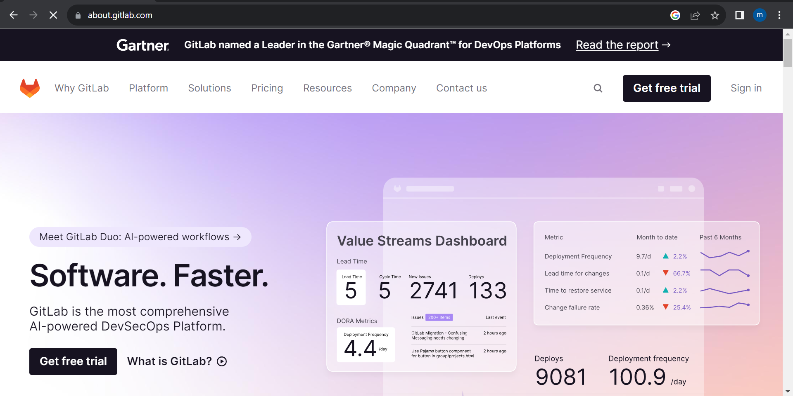

# **PEMBUATAN AKUN GITLAB**
------------------------

## Daftar Judul
Untuk mendaftar github diperlukan beberapa tahap sebagai berikut :
1. Ikhtisar
1. Daftar Judul
1. Persiapan Awal
1. Masuk ke beranda situs gitlab
1. Masuk ke halaman pendaftaran
1. Lengkapi data pendaftaran
1. Verifikasi dengan cek inbox email
1. Login akun baru

## Persiapan awal
- Email aktif 
  Untuk mendaftar gitlab diperlukan email aktif untuk aktifasi akun.
- Data Diri
- Username unik baru
- Password baru

## Masuk ke beranda situs gitlab
...
## Masuk ke halaman pendaftaran
...
## Lengkapi data pendaftaran
...
## Verifikasi dengan cek inbox email
...
## Login akun baru

## Apa itu GitLab?
Sebelumnya apakah Anda tahu apa itu GitLab? GitLab adalah layanan yang menyediakan akses remote ke Git repositories. Selain meng-hosting kode Anda, layanan ini menyediakan fitur tambahan yang dirancang untuk membantu mengelola siklus pengembangan software. Git adalah sebuah tools yang berfungsi untuk memudahkan para developer. Disini Saya akan menjelaskan tata cara pembuatan akun GitLab.

## Fitur dan Fungsinya
Dengan menggunakan GitLab, Anda akan mendapatkan alur manajemen git-repository yang handal. Selain itu, penggunaannya dapat melibatkan beberapa orang sehingga sifatnya kolaboratif. Berikut fitur dan fungsi GitLab secara lebih lengkap:

* **Docker** – menampung semuanya dalam suatu “wadah” secara bebas melalui in-built registry yang bisa langsung digunakan tanpa perlu konfigurasi.
* **Third-party Servers** – digunakan untuk mengelola kumpulan file yang menunjang aplikasi.
* **Infrastructure Management** – menunjukkan seberapa baik Kubernetes diatur sehingga dapat membantu proses integrasi di dalamnya.
* **Deployment** – menjamin kualitas dasar dengan menyebarkan tiap cabang dan menggabungkan tim Dev bersama tim QA.
* **Project Management** – menyediakan alur kerja yang ekstensif, seperti pencapaian grup, grafik burnup dan burndown, target penyelesaian masalah, serta memungkinkan ekspor kode dalam jumlah besar. 
* **Integrated Monitoring** – mengumpulkan semua pengukuran kinerja untuk aplikasi dan server yang membantu pengguna menentukan efek dari sistem produksi. 

## Cara Menggunakan Gitlab
Apakah Anda tertarik untuk mencoba platform ini? Jika iya, maka kami sarankan untuk memahami langkah-langkahnya terlebih dahulu. Mulai dari menginstal, melakukan registrasi, hingga implementasinya pada pengembangan web. Simak caranya di bawah ini:

* Registrasi dan Login GitLab
1. Langkah pertama adalah membuka situs [GitLab.com](https://about.gitlab.com/), Jika sudah terbuka maka akan keluar tampilan seperti dibawah ini :

2. Click **_Sign.in_** yang berada di pojok kanan atas, jika sudah maka akan keluar tampilan seperti ini lagi. 

Sebagaimana registrasi akun pada umumnya, Anda cukup mengisi identitas pada form yang disediakan. Anda juga bisa scroll kebawah untuk registrasi menggunakan akun google, pilih akun yang ingin anda pakai untuk registrasi dan pastikan akun tersebut aktif.  

3. Setelah selesai memasukkan email dan password yang benar, maka anda akan mendapatkan kode verifikasi ke email tersebut untuk keamanan bahwa itu adalah akun email milik anda sendiri, seperti pada gambar dibawah ini.

Masukkan kode veritifikasi dengan benar, tekan tombol **Verify email address** hingga berubah ke-slide **'Verification successfull'**.

4. Setelah suskses memasukkan kode verifikasi tersebut, slide selanjutnya akan bertampilan seperti ini :

Anda bisa memilih sesuai minat yang anda inginkan, setelah selesai anda bisa menekan tombol **'Continue'** untuk menuju ke slide berikutnya.

5. Jika anda memilih *_Creat a new project_* di slide sebelumnya maka anda bisa membuat group/projek anda sendiri, seperti yang tertera pada gambar dibawah ini.

Jika sudah selesai click **Create project**

6. Maka akan menampilkan slide berikutnya

Click **Ok,let's go**

7.  Disini anda bisa menambah kolega, dan jika tidak ingin silahkan click _cancel_

8.  Selamat datang di GitLab!

